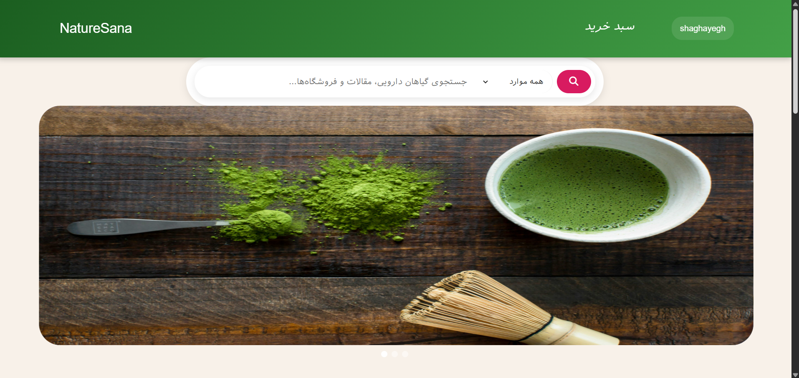
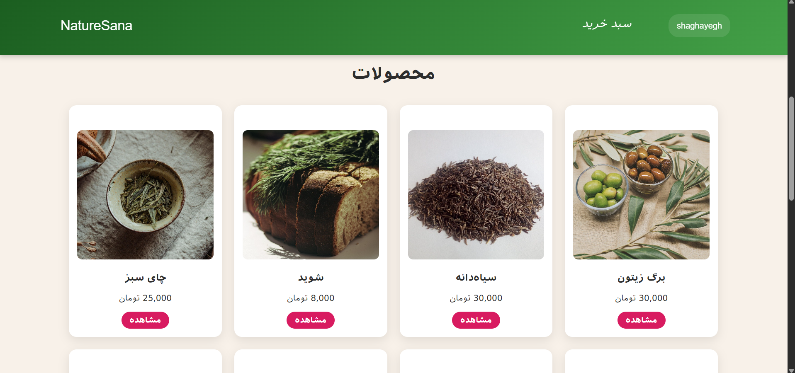
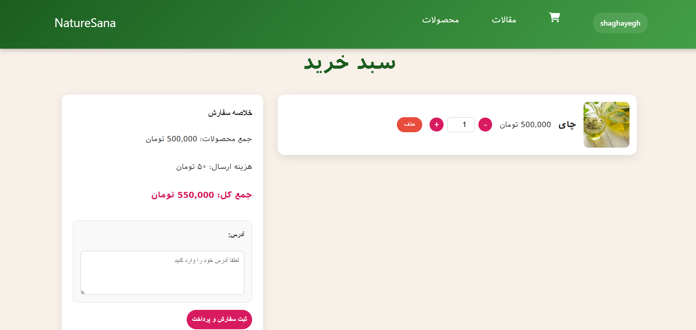
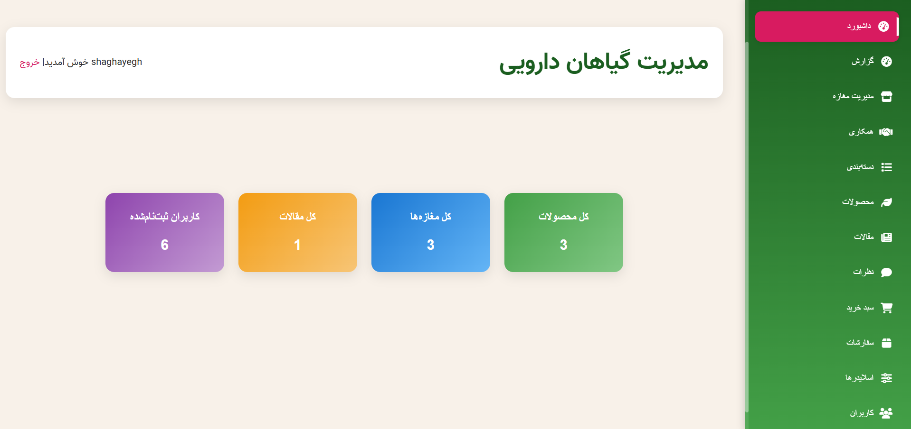

    

<h2 align="center">🌿 NatureSana | فروشگاه آنلاین گیاهان دارویی</h2>

    پروژه‌ای برای خرید، فروش، و مدیریت گیاهان دارویی با قابلیت همکاری بین فروشگاه‌ها

---

## درباره پروژه

 یک فروشگاه آنلاین گیاهان دارویی است که با استفاده از فریم‌ورک [Laravel](https://laravel.com) توسعه داده شده است. این پلتفرم به کاربران امکان می‌دهد تا گیاهان دارویی را مشاهده، جستجو و خرید کنند. همچنین فروشگاه‌ها می‌توانند همکاری کرده و محصولات خود را به اشتراک بگذارند.

### ✨ امکانات کلیدی:

- ثبت‌نام و ورود کاربران و مدیران فروشگاه‌ها
- مدیریت فروشگاه و محصولات توسط ادمین فروشگاه
- همکاری بین فروشگاه‌ها و نمایش محصولات همکار
- سبد خرید، سفارش‌گذاری و پرداخت
- مدیریت موجودی و وضعیت سفارش
- امکان ثبت سه آدرس برای کاربران
- بخش مقالات و نظرات کاربران
- پنل سوپرادمین برای مدیریت کل سایت

---

## 🔧 تکنولوژی‌ها و ابزارها

- PHP 8.x
- Laravel 11
- MySQL
- Blade Template Engine
- Bootstrap 

---

## 🖼️ تصاویر صفحات اصلی

| صفحه | پیش‌نمایش |
|------|-----------|
| صفحه اصلی |  |
| صفحه محصولات |  |
| سبد خرید |  |
| پنل مدیریت فروشگاه |  |

---

